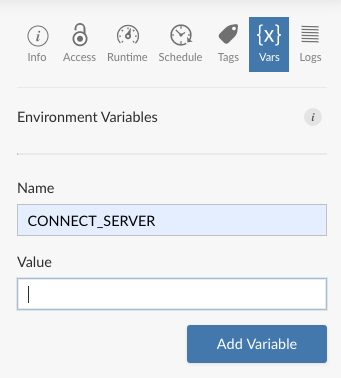
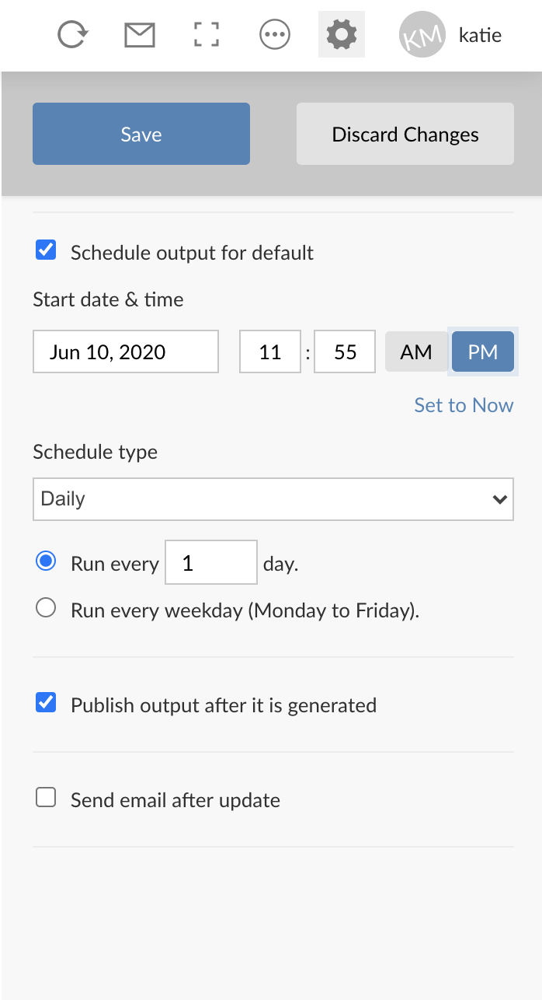

```{r setup}
knitr::opts_chunk$set(echo = TRUE)
```

```{r Generate Helpful Messages if Environment Variables Are Not Set}
# Part of this exercise involves setting an API Key and a system environment variable.  We will walk through this process, but for now, this code will set helpful message if you try to knit or deploy this R Markdown file rather than result in a deployment error.

if(Sys.getenv('CONNECT_SERVER') == '') { "<h4>ERROR: You must set the CONNECT_SERVER environment variable</h4>\n" }
if(Sys.getenv('CONNECT_API_KEY') == '') { "<h4>ERROR: You must set the CONNECT_API_KEY environment variable</h4>\n" }
if(Sys.getenv('CONNECT_API_KEY') == '' || Sys.getenv('CONNECT_SERVER') == '') { knitr::knit_exit() }
```
<span style="color: red;">Fix the code chunk - not showing as h4 for me</span>
# Purpose
This document provides a follow-along example of:  

* Creating a pin on RStudio Connect 
* Retrieving a pin from RStudio Connect 
* Scheduling a pin on RStudio Connect to create a basic ETL system to support downstream analyses  

If you would like a more in depth reference for what pins are and what makes a good use case for pins, see the Customer Success Pro Tip: Creating Efficient Workflows with `pins` and RStudio Connect at https://colorado.rstudio.com/rsc/ProTips-pins/. <span style="color: red;">Verify the path here - point to Colorado or to rstudio.com/resources/?</span>

# Prework   
**API keys** let the RStudio IDE communicate with Connect on our behalf, acting as our credentials.  The steps below will save your credentials and Connect server information as environment variables so they will be available now and for future work, so these are one-time only steps:  

1. Create an API key from RStudio Connect (See: https://docs.rstudio.com/connect/user/api-keys/) Give this key any name you like, such as `CONNECT_API_KEY` and be certain to copy the value to your clipboard. 
1. Return to the RStudio IDE and save your API key as a system environment variable in your .Rprofile^[If you feel strongly about using .Renviron instead of .Rprofile, go right ahead. If want to start a friendly debate among colleagues, ask their preference.  For further reading, see: https://support.rstudio.com/hc/en-us/articles/360047157094-Managing-R-with-Rprofile-Renviron-Rprofile-site-Renviron-site-rsession-conf-and-repos-conf] file:  
    a. In the Console, enter `usethis::edit_r_profile()` to open your .Rprofile for editing.
    a. In the .RProfile file, insert `Sys.setenv("CONNECT_API_KEY" = "key value from your clipboard")`.
1. For convenience, save your RStudio Connect server address as a system environment variable in your .RProfile as well. Example: `Sys.setenv("CONNECT_SERVER" = "https://your-server-address.com/")`
1. Save and close the file. 
1. Restart R (shift + cmd + F10)

If you're using git, it's a good idea to add your .RProfile to your .gitignore, perhaps with `usethis::use_git_ignore()`, to ensure you're not publishing your API key to your version control system.

**Install  `pins`.** The `pins` package is available on CRAN, and was at version 0.4.1 at the time of this writing.  Install `pins` with `install.packages("pins")`.  

Now let's get cooking! 

# Creating a pin
Let's say we are running an important analysis that involves body temperature measurements of beavers. Let's look at our data first.  

```{r}
library(datasets)
head(beaver1)
```

Nice looking data!

Now we want to pin this data to RStudio Connect so it is also accessible to our eager colleagues for their important work and we won't have to email this around as a csv file.  This makes a great use case for pins.  The data itself isn't too large (less than a few hundred megabytes) and we need an easy way to call this data later.  Let's get started!

First, **register the board**.  Registering just means you're identifying a location where you can store resources. 
```{r}
pins::board_register(
    "rsconnect", 
    server = Sys.getenv("CONNECT_SERVER"),  
    key = Sys.getenv("CONNECT_API_KEY")
    )
```

After running the script above, did you see that the Connections pane in your RStudio IDE now shows the board `rsconnect`?  This gives you an easy way to browse your organization's pinned objects.  Here's what mine looks like:  
  
```{r, echo=FALSE, out.width = '65%', out.extra = 'style="background-color: #447099; padding:5px;"'}
knitr::include_graphics("images/connections_pane.png")
```
  
## Pin the data
 
Now we want to **pin our data** to RStudio Connect. 

_Before you run this code chunk_: Update the `name = "mydata"` parameter to give your pin a unique name identifier on the server.

```{r}
#MUST FIX THIS CODE TO MAKE IT MORE ROBUST. TOO MANY BEAVERS ON CONNECT BREAKS THIS.
pins::pin(beaver1, name = "beaver1", description = "Beaver Body Temperature Measurements", board = "rsconnect")
```

The `name argument` becomes part of the file path for retrieving the pin, so avoid special characters and spaces.  The `board` argument tells the `pins` package that the destination is RStudio Connect. Change this argument if you are bound for other destinations. 

Take a moment to switch to the RStudio Connect content dashboard and give yourself a pat on the back. **Your data is now pinned!**

## Visit your new pin

From the dashboard, you can adjust the user access permissions, add collaborators, and even give your pin a custom content URL.  If you want to see my pin, access it at https://colorado.rstudio.com/rsc/beavers/.

```{r, echo=FALSE, out.width = '100%', out.extra = 'style="background-color: #447099; padding:5px;"'}
knitr::include_graphics("images/pinned_to_connect.png")
```

# Retrieving a pin  
Now let's pretend you're a colleague and you want to access this data for your own analysis.  

Feel free to put on a hat if it helps you to get into character. Keep in mind that your colleague won't have access to your environment with your API key -- this is by design! We don't recommend you share API keys with other people. For someone else to retrieve your pin, two things need to happen:

1. **_You need_** to give them permission by adjusting the **Access Settings** on your pin in the RStudio Connect content dashboard.
2. **_They need_** to generate an API key from their own RStudio Connect account, just like you did way back in the **Prework** section. 
  
Okay, if we imagine that all of those things have taken place, let's get the dataset from RStudio Connect. 

In RStudio Connect, did you notice the header information on your pin?  This is present on every pin published to Connect and it provides the code to retrieve the pin using either R or Python.  Handy, huh?  

```{r, echo=FALSE, out.width = '100%', out.extra = 'style="background-color: #447099; padding:5px;"'}
knitr::include_graphics("images/retrieval_code.png")
```

So let's copy that code into our analysis and **retrieve the pin**. 

Replace the `# Retrieve Pin` code section below with the sample from your own pin:

```{r}
# Register RStudio Connect
library(pins)
pins::board_register("rsconnect",
               key = Sys.getenv("CONNECT_API_KEY"),
               server = Sys.getenv("CONNECT_SERVER"))

# Retrieve Pin (Replace the code below with the code provided on your own Connect server)
# beaver_data <- pin_get("user/pin_name", board = "rsconnect")
  
# View the pin locally
# head(beaver_data)
```

Jackpot! We have our data. You're a busy beaver today, but there's more to do.

# Scheduling a pin
So you think you're hot stuff and off and running?  Yeah, you're pretty cool.  But now it's time to really up your game.  Pins really shine as part of a workflow.  We are going to create a pin as part of a scheduled ETL process so that any downstream analyses or data products (e.g., Shiny app, R Markdown analysis, or a model) can reference this pinned data source for the most up to date information.  The magic in this is your downstream artifact does not need to be redeployed when the supporting data is updated; because it pulls the data from a scheduled pin, you're always up to date! 

## Make a pin that needs to be updated
The beavers were great, but that data was a bit static. Let's make another pin, this time with some data that can be refreshed. For this example, let's make a very simple, but ephemeral, data frame that is based on the current date and time. 
```{r}
suppressPackageStartupMessages(library(tidyverse))
suppressPackageStartupMessages(library(lubridate))
# Make a tibble with date/time information leading up to now
df <- tibble(date_time = 
               seq(from = now() - hms("24:00:00"),
                   to = now(),
                   length.out = 10)
             )

# Separate this into multiple columns and add a column of random data
ephemeral <- df %>% 
  separate(date_time, " ", into = c("Date", "Time")) %>% 
  mutate(Value = runif(n(), 0, 100))

head(ephemeral)
```
Excellent! Now let's pin it.  Do you remember how?
```{r}
pins::board_register(
    "rsconnect", 
    server = Sys.getenv("CONNECT_SERVER"),  
    key = Sys.getenv("CONNECT_API_KEY")
)

pins::pin(ephemeral, name = "ephemeral-data", board = "rsconnect")
```

## Publish your ETL 
This R Markdown file will serve as our ETL.  Once this is on Connect, you can schedule this document to run and your published pin will be repinned every time it runs. So go ahead, try to **publish this document to your RStudio Connect server** right now. 

Did you just get a big ugly error message like this?  Or was it an angry red message in your Console? <span style="color: red;">update the picture since the title has changed. and get h4 to render correctly</span>

```{r, echo=FALSE, out.width = '100%', out.extra = 'style="background-color: #447099; padding:5px;"'}
knitr::include_graphics("images/env_var_error.png")
```

Stop cursing! This is one time that an error message is good. You've done everything correctly so far! 

This error is telling us that RStudio Connect can't find the environment variables. 

*"API keys again? I thought this was a `pins` lesson, not an API key lesson!"*  

Yes, so as discussed in the Prework section, we used our API key in the RStudio IDE session so that RStudio Connect could authenticate you acting through the IDE. This time, the `rstudio-connect` user needs an API key to access your pinned content.   

As a side note, remember the code chunk at the beginning of this R Markdown titled `Generate Helpful Messages if Environment Variables Are Not Set`?  This was a friendly way to help your content deploy to Connect and also point out your missing environment variables.  Regardless of where or how your error presents, it's easy to address.

## Recover from the error

In the RStudio Connect content settings panel, select the **Vars** option and **create environment variables for `CONNECT_API_KEY` and `CONNECT_SERVER`** - values will appear in plain text until you hit **Save**.

```{r, echo=FALSE, out.width = '40%', out.extra = 'style="background-color: #447099; padding:5px;"'}

```
  
Click the **Refresh Report** button (*the button!* don't just refresh your browser window) to re-render your document with the new environment variables in place.  Hold breath... and...

```{r, echo=FALSE, out.width = '100%', out.extra = 'style="background-color: #447099; padding:5px;"'}
knitr::include_graphics("images/deploy_success.png")
```

Voilà!  Congratulations!  You're a pinning machine. **You've now deployed content that includes references to a pinned object.**  

From here, visit the **Schedule** button and establish your desired update frequency for your ETL to run and repin your data. 
```{r, echo=FALSE, out.width = '40%', out.extra = 'style="background-color: #447099; padding:5px;"'}

```

Now you have published and scheduled your R Markdown ETL and you have a resulting pin that is also published and updated. Use your pin retrieval skills practiced above to include this pin in your downstream analyses to always have a fresh source of data behind it. Awesome work!  

# Learn more about pins 

1. [Read the reference guide on using RStudio Connect Pin Boards](http://pins.rstudio.com/articles/boards-rsconnect.html)
2. [Find more great how-to guides for Pins like these](http://pins.rstudio.com/articles/use-cases.html):  
    - [Automate Dataset Updates](http://pins.rstudio.com/articles/use-cases/automate-dataset-updates.html)
    - [Create Data Pipelines](http://pins.rstudio.com/articles/use-cases/create-data-pipelines.html)
    - [Update Plumber and Shiny Apps](http://pins.rstudio.com/articles/use-cases/update-plumber-and-shiny-apps.html)