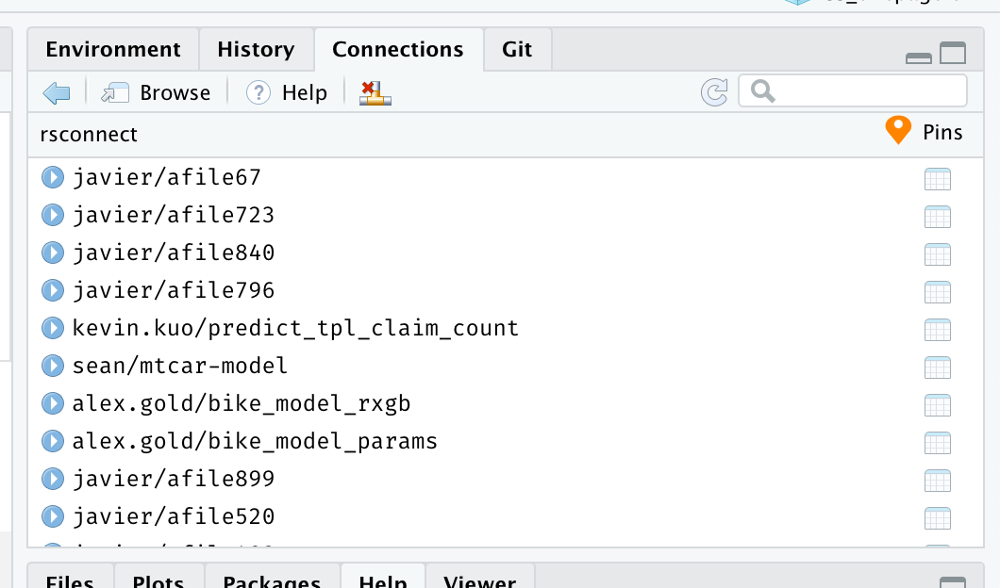
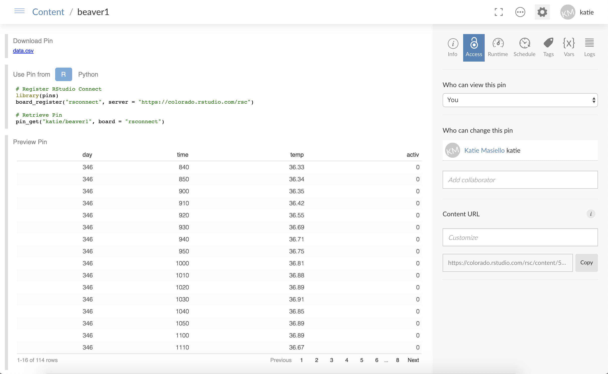
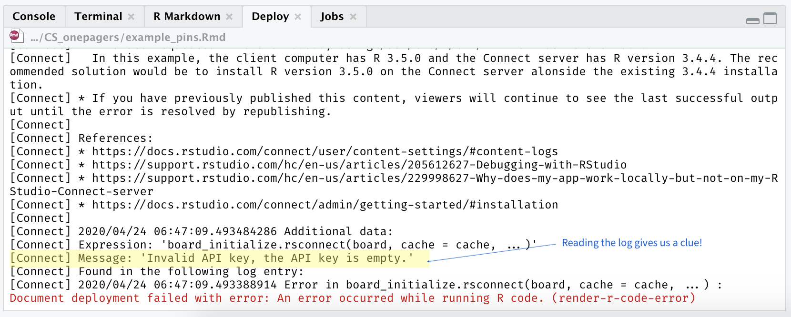

```{r setup, include=FALSE}
knitr::opts_chunk$set(echo = TRUE)
```
This document is meant to provide a follow-along example of:  

* Creating a pin  
* Publishing a pin to RStudio Connect 
* Retrieving a pin from RStudio Connect 
* Publishing content that references a pin to RStudio Connect  

This was built using `pins` version `r packageVersion("pins")` and is supplemental material to the RStudio Customer Success Pro Tip: Creating Efficient Workflows with `pins`. 

# Prework
Prior to running this script, ensure you have created an API key from RStudio Connect (see: https://docs.rstudio.com/connect/user/api-keys/) and saved this into your system environment variables with:
```{r eval=FALSE}
# Sys.setenv("RSC_API_KEY" = “key value”) 
# Do this once and do it in your Console and not as part of your script.  Keep your keys secure!
```

Let's say we are running an important analysis that requires body temperature mesurements of beavers. Let's look at our data first.  
```{r}
library(datasets)
head(beaver1)
```
Very nice!

Now we want to pin this data to Connect so it is accessible to our colleagues for their important work.  

First, register the board so your session knows that it can place content on your Connect board:
```{r}
pins::board_register(
    "rsconnect", 
    server = "https://colorado.rstudio.com/rsc", # <- replace this with your server name 
    key = Sys.getenv("RSC_API_KEY")
    )
```

After you ran the script above, did you see the Connections pane in your RStudio IDE now shows the board `rsconnect`?  Here's what mine looks like:  
```{r, echo=FALSE, out.width = '65%'}

```
  
Now we want to pin our beaver data to Connect. 
```{r}
pins::pin(beaver1, description = "Beaver Body Temperature Measurements", board = "rsconnect")
```

Take a moment to switch to Connect and give yourself a pat on the back.  Your data is now pinned on Connect!  
```{r, echo=FALSE, out.width = '100%'}

```
  
From this window in Connect, you can adjust the user access permissions, add collaborators, and even give your pin a custom URL (see mine at https://colorado.rstudio.com/rsc/beaver-data/)  
```{r, echo=FALSE, out.width = '30%'}
knitr::include_graphics("pin_access_controls_and_vanityURL.png")
```
  
Now let's pretend you're a colleague and you want to access this data for your own analysis.  First we'll 
restart our R session to give a clean slate.  Feel free to put on a hat if it helps you to get into character.
```{r}
#rstudioapi::restartSession() 
```

Notice that your Environment pane is now empty.  No beavers there.  
```{r, echo=FALSE, out.width = '50%'}
knitr::include_graphics("empty_environments_pane.png")
```
  
Now let's get the dataset from Connect. 

In Connect, did you notice the header information on your pin?  This is present on every pin published to Connect and it provides the code in  R or Python to retrieve your pin.  Handy, huh?  
```{r, echo=FALSE, out.width = '100%'}
knitr::include_graphics("retrieval_code.png")
```
  
So let's copy that code into our analysis and assign the retrieved pin as a variable.
```{r}
# Register RStudio Connect
library(pins)
board_register("rsconnect", server = "https://colorado.rstudio.com/rsc",
    key = Sys.getenv("RSC_API_KEY"))

# Retrieve Pin
beaver_data <- pin_get("katie/beaver1", board = "rsconnect")

#Check out the pin
head(beaver_data)
```
  
Jackpot!  

So you think you're hot stuff and off and running?  For now, perhaps.  But let's say you want to publish something to Connect (like this RMD file), which uses pinned content in it.  Go ahead, try publishing this document to Connect right now. 

Did you just get a ugly, angry, red error message?  
```{r, echo=FALSE, out.width = '80%'}

```


Stop cursing! This is one time that the error message is good.  You've done it all right so far! Your error message might look a little different from mine, depending on what version of Connect you have, but the issue is the same.  This error is telling us that Connect can't find an API key.  *"API keys again? Didn't we do that already?"*  Yes, we did that for the RStudio IDE session, but not for Connect.  Stick with me and we'll get there.  

Jump over to Connect and open your sad, un-rendered content.  
```{r, echo=FALSE, out.width = '100%'}
knitr::include_graphics("sad_unrendered_content.png")
```
  
Now in the right hand side pane, select the 