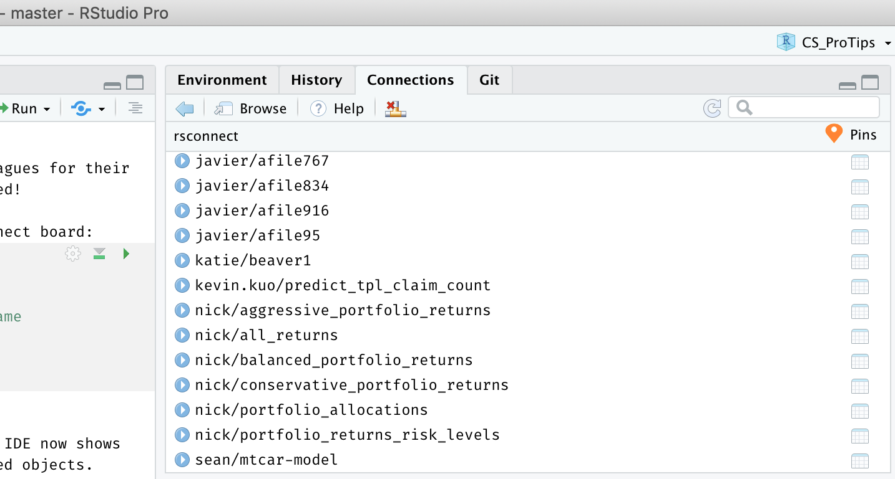

```{r setup}
knitr::opts_chunk$set(echo = TRUE)
if(Sys.getenv('CONNECT_SERVER') == '') { "<h4>ERROR: You must set the CONNECT_SERVER environment variable</h4>\n" }
if(Sys.getenv('CONNECT_API_KEY') == '') { "<h4>ERROR: You must set the CONNECT_API_KEY environment variable</h4>\n" }
if(Sys.getenv('CONNECT_API_KEY') == '' || Sys.getenv('CONNECT_SERVER') == '') { knitr::knit_exit() }
```

# Purpose
This document provides a follow-along example of:  

* Creating a pin on RStudio Connect 
* Retrieving a pin from RStudio Connect 
* Publishing content that uses a pin to RStudio Connect  


# Notes 
<span style="color: red;">Kelly removed this. Should this be included?</span>
This was built using `pins` version `r packageVersion("pins")` and is supplemental material to the RStudio Customer Success Pro Tip: Creating Efficient Workflows with `pins` at https://colorado.rstudio.com/rsc/ProTips-pins/. 

# Prework: API Keys    
API keys will let the RStudio IDE communicate with Connect on our behalf, acting as our credentials.  The steps below will save your credentials for future work, so these are one-time only steps:  

1. Create an API key from RStudio Connect (See: https://docs.rstudio.com/connect/user/api-keys/) Give this key any name you like, such as `CONNECT_API_KEY` and be certain to copy the value to your clipboard. 
1. Return to the RStudio IDE and save your API key as a system environment variable in your .Rprofile file:  
    a. In the Console, enter `usethis::edit_r_profile()` to open your .Rprofile for editing.
    a. In the .RProfile file, insert `Sys.setenv("CONNECT_API_KEY" = "key value from your clipboard")`.
1. For convenience, save your RStudio Connect server address as a system environment variable in your .RProfile as well. Example: `Sys.setenv("CONNECT_SERVER" = "https://your-server-address.com/")`
1. Save and close the file. 
1. Restart R (shift + cmd + F10)

# Creating a pin
Let's say we are running an important analysis that involves body temperature mesurements of beavers. Let's look at our data first.  

```{r}
library(datasets)
head(beaver1)
```

Nice looking data!

Now we want to pin this data to RStudio Connect so it is also accessible to our colleagues for their important work and we won't have to email this around as a csv file.  Let's get started!

First, **register the board**.  Registering just means you're identifying a location where you can store resources.  The RStudio IDE is registering, or recognizing, that it can place content on your Connect board:
```{r}
pins::board_register(
    "rsconnect", 
    server = Sys.getenv("CONNECT_SERVER"),  
    key = Sys.getenv("CONNECT_API_KEY")
    )
```

After running the script above, did you see that the Connections pane in your RStudio IDE now shows the board `rsconnect`?  This gives you an easy way to browse your organization's pinned objects.  Here's what mine looks like:  
  
```{r, echo=FALSE, out.width = '65%', out.extra = 'style="background-color: #447099; padding:5px;"'}

```
  
## Pin the data
 
Now we want to **pin our data** to RStudio Connect. 

_Before you run this code chunk_: Update the `name = "mydata"` parameter to give your pin a unique name identifier on the server.

```{r}
pins::pin(beaver1, name = "morebeaverdata", description = "Beaver Body Temperature Measurements", board = "rsconnect")

```

Take a moment to switch to the RStudio Connect content dashboard and give yourself a pat on the back. **Your data is now pinned!**

## Visit your new pin

From the dashboard, you can adjust the user access permissions, add collaborators, and even give your pin a custom content URL.

```{r, echo=FALSE, out.width = '100%', out.extra = 'style="background-color: #447099; padding:5px;"'}
knitr::include_graphics("images/pinned_to_connect.png")
```

# Retrieving a pin  
Now let's pretend you're a colleague and you want to access this data for your own analysis.  

Feel free to put on a hat if it helps you to get into character. Keep in mind that your colleague won't have access to your environment with your API key -- this is by design! We don't recommend you share API keys with other people. For someone else to retrieve your pin, two things need to happen:

1. **_You need_** to give them permission by adjusting the **Access Settings** on your Pin in the RStudio Connect content dashboard.
2. **_They need_** to generate an API key from their own RStudio Connect account, just like you did way back in the **Prework** section. 
  
Okay, if we imagine that all of those things have taken place, let's get the dataset from RStudio Connect. 

In RStudio Connect, did you notice the header information on your pin?  This is present on every pin published to Connect and it provides the code to retrieve your pin in either R or Python.  Handy, huh?  

```{r, echo=FALSE, out.width = '100%', out.extra = 'style="background-color: #447099; padding:5px;"'}
knitr::include_graphics("images/retrieval_code.png")
```

So let's copy that code into our analysis and **retrieve the pin**. 

Replace the `# Retrieve Pin` code section below with the sample from your own pin:

```{r}
# Register RStudio Connect
library(pins)
pins::board_register("rsconnect",
               key = Sys.getenv("CONNECT_API_KEY"),
               server = Sys.getenv("CONNECT_SERVER"))

# Retrieve Pin
# beaver_data <- pin_get("your/pin", board = "rsconnect")
  
# View the pin locally
# head(beaver_data)
```

Jackpot! We have our data.

# Using pins in content 

So you think you're hot stuff and off and running?  For now, perhaps.  But let's say you want to publish something to RStudio Connect (like this RMD file), which uses pinned content in it.

## Try publishing

Go ahead, try **publishing this document to your RStudio Connect server** right now. 

Did you just get a big ugly error message?  

```{r, echo=FALSE, out.width = '100%', out.extra = 'style="background-color: #447099; padding:5px;"'}
knitr::include_graphics("images/env_var_error.png")
```

Stop cursing! This is one time that an error message is good. You've done everything correctly so far! 

This error is telling us that RStudio Connect can't find the environment variables. 

*"API keys again? I thought this was a `pins` lesson, not an API key lesson!"*  

Yes, so as alluded to in the previous section, we used our API key in the RStudio IDE session so that RStudio Connect could authenticate you acting through the IDE. This time, the `rstudio-connect` user needs an API key to access your pinned content.   

## Recover from the error

In the RStudio Connect content settings panel, select the **Vars** option and **create environment variables for `CONNECT_API_KEY` and `CONNECT_SERVER`** - values will appear in plain text until you hit **Save**.

```{r, echo=FALSE, out.width = '40%', out.extra = 'style="background-color: #447099; padding:5px;"'}
knitr::include_graphics("images/add_env_vars.png")
```
  
Click the **Refresh Report** button to re-render your document with the new environment variables in place.  Hold breath... and... 

```{r, echo=FALSE, out.width = '100%', out.extra = 'style="background-color: #447099; padding:5px;"'}
knitr::include_graphics("images/deploy_success.png")
```

Voilà!  Congratulations!  You're a pinning machine. **You've now deployed content that includes references to a pinned object.**

# Learn more about pins 

1. [Read the reference guide on using RStudio Connect Pin Boards](http://pins.rstudio.com/articles/boards-rsconnect.html)
2. [Find more great how-to guides for Pins like these](http://pins.rstudio.com/articles/use-cases.html):  
    - [Automate Dataset Updates](http://pins.rstudio.com/articles/use-cases/automate-dataset-updates.html)
    - [Create Data Pipelines](http://pins.rstudio.com/articles/use-cases/create-data-pipelines.html)
    - [Update Plumber and Shiny Apps](http://pins.rstudio.com/articles/use-cases/update-plumber-and-shiny-apps.html)